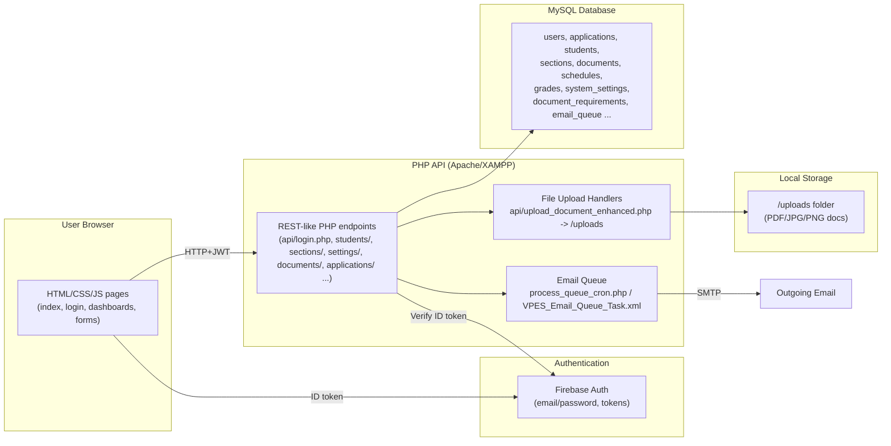

# VPES-SIMS Architecture

## Notes
- Frontend: static HTML/CSS/JS pages served by Apache; JS calls PHP APIs and uses Firebase Auth for ID tokens.
- Backend: PHP endpoints under `api/` handle enrollment, users, sections, documents, schedules, grades, settings; cron/email queue scripts send notifications.
- Data: MySQL stores users, applications, students, sections, documents, schedules, grades, settings, document requirements, email queue.
- Files: uploaded documents saved under `/uploads` (PDF/JPG/PNG); handled by `upload_document_enhanced.php`.
- Auth flow: browser obtains Firebase ID token; PHP APIs validate token/role before DB or file operations.

## Component Breakdown
- **Client (Browser):** Static HTML/CSS/JS pages for public, student, admin, and teacher flows. JS calls PHP APIs with Firebase ID tokens in headers and renders results dynamically.
- **Authentication (Firebase Auth):** Manages user sign-up/login, issues ID tokens; roles (admin/teacher/student) enforced server-side using token claims + DB role checks.
- **Web Server (Apache on XAMPP):** Serves static assets and routes API requests to PHP scripts under `api/`.
- **Backend APIs (PHP):** REST-like endpoints grouped by domain (login, applications, students, sections, documents, schedules, grades, settings, document requirements). Input validation, auth checks, and DB CRUD. Some endpoints trigger side effects (auto-create students on enrollment, update section counts, enqueue emails).
- **Database (MySQL):** Core schema for users, applications, students, sections, documents, schedules, grades, system_settings, document_requirements, email_queue. Relational links ensure referential integrity across enrollment and records.
- **File Storage (Local uploads):** `/uploads` directory holds submitted documents (PDF/JPG/PNG); metadata recorded in `documents` table; served via Apache with path controls.
- **Background/Batch Jobs:** Email queue processed by `process_queue_cron.php` (triggered via Task Scheduler/cron) to send notifications; import scripts for CSV ingest; potential scheduled cleanups.
- **External Services:** Firebase for authentication; SMTP for outgoing email (used by the queue).

## Core Flows
- **Enrollment:** Applicant fills `applicationform.html` → `submit_application.php` stores application + docs metadata → Admin reviews in `applications.html` → On status = ENROLLED, backend creates student record, links to section, updates counts.
- **Document Management:** Students upload via `uploadDocument.html` → `upload_document_enhanced.php` validates, writes to `/uploads`, records in `documents` table → Admin verifies in `documents.html`; requirements driven by `document_requirements` table and related APIs.
- **Section Management & Assignment:** Admin manages sections via `sections.html` → APIs create/update/delete sections, enforce capacities, and assign/move students, updating counts atomically.
- **Grades & Schedules (in-progress):** Students view grades/schedules; future teacher-facing inputs to write grades and schedules via dedicated APIs.
- **User Management:** Admin creates/updates roles via `users.html`; backend verifies Firebase token and role before privileged operations.
- **Notifications:** API enqueues messages into `email_queue`; `process_queue_cron.php` sends via SMTP and marks status.

## Security & Validation
- Firebase ID tokens required for authenticated endpoints; server validates token signature and expiration.
- Role/permission checks against DB roles for admin/teacher/student actions.
- Input validation on APIs (expected fields, file types, size limits, required document rules).
- File upload protections: extension/size checks, stored outside code paths; metadata in DB to audit.
- No-cache headers for dynamic requirements; DB constraints (e.g., unique document keys, LRN uniqueness) to prevent duplicates.
