# VPES-SIMS Architecture

## System Overview Diagram

```mermaid
graph TB
    subgraph LAYER1["🌐 LAYER 1: PRESENTATION LAYER"]
        BROWSER["Web Browser<br/>Chrome, Firefox, Edge"]
        PUBLIC["Public Pages<br/>Landing, Login, Apply"]
        STUDENT["Student Portal<br/>Dashboard, Documents, Grades"]
        TEACHER["Teacher Portal<br/>Grades, Schedule, Students"]
        ADMIN["Admin Portal<br/>Applications, Users, Sections"]
    end

    subgraph LAYER2["🔐 LAYER 2: SECURITY & AUTHENTICATION"]
        FIREBASE["Firebase Auth<br/>Email/Password Login"]
        GATEWAY["API Gateway<br/>Request Router & Validator"]
        TOKENS["JWT Tokens<br/>Session Management"]
    end

    subgraph LAYER3["⚙️ LAYER 3: APPLICATION LAYER - Business Logic"]
        direction LR

        subgraph ENROLLMENT["Enrollment Management"]
            APPS["Applications<br/>Submit & Review"]
            DOCS["Document Upload<br/>Birth Cert, Report Cards"]
            STATUS["Status Tracking<br/>Pending/Approved/Enrolled"]
        end

        subgraph ACADEMIC["Academic Management"]
            STUDENTS["Student Records<br/>LRN, Profile, Section"]
            SECTIONS["Section Management<br/>Create & Assign"]
            SCHEDULES["Class Schedules<br/>Timetables & Subjects"]
            GRADES["Grade Management<br/>Quarterly Grades"]
        end

        subgraph SYSTEM["System Management"]
            USERS["User Accounts<br/>Admin/Teacher/Student"]
            SETTINGS["System Settings<br/>School Year, Enrollment Period"]
            DOCREQ["Document Requirements<br/>Dynamic Config"]
        end

        subgraph COMMS["Communication"]
            EMAILQ["Email Queue<br/>Notifications & Alerts"]
            MESSAGES["Announcements<br/>System Messages"]
        end
    end

    subgraph LAYER4["💾 LAYER 4: DATA PERSISTENCE"]
        direction LR

        subgraph DATABASE["🗄️ MySQL Database"]
            USERTBL["users<br/>Accounts & Roles"]
            APPTBL["applications<br/>Enrollment Forms"]
            STUDENTTBL["students<br/>Student Records"]
            SECTIONTBL["sections<br/>Class Sections"]
            DOCTBL["documents<br/>File Metadata"]
            GRADETBL["grades<br/>Academic Records"]
            SCHEDULETBL["schedules<br/>Class Timetables"]
            SETTINGSTBL["system_settings<br/>Configuration"]
            EMAILTBL["email_queue<br/>Outgoing Messages"]
        end

        subgraph STORAGE["📁 File Storage"]
            UPLOADS["uploads folder<br/>PDF, JPG, PNG"]
            DOCSEC["Document Security<br/>Access Control"]
            BACKUP["Backup Files<br/>Data Protection"]
        end
    end

    subgraph LAYER5["🏗️ LAYER 5: INFRASTRUCTURE"]
        APACHE["Apache Server<br/>XAMPP Web Server"]
        PHP["PHP Runtime<br/>Backend Processing"]
        MYSQL["MySQL Server<br/>Database Engine"]
        CRON["Task Scheduler<br/>Email Queue Processor"]
        SMTP["SMTP Service<br/>Email Delivery"]
    end

    %% LAYER 1 → LAYER 2
    BROWSER -->|"HTTPS Requests"| GATEWAY
    PUBLIC -->|"Access"| GATEWAY
    STUDENT -->|"Authenticated"| FIREBASE
    TEACHER -->|"Authenticated"| FIREBASE
    ADMIN -->|"Authenticated"| FIREBASE

    %% LAYER 2 → LAYER 3
    FIREBASE -->|"ID Tokens"| TOKENS
    GATEWAY -->|"Route & Validate"| APPS
    TOKENS -->|"Authorize"| USERS

    %% LAYER 3 ENROLLMENT → LAYER 4
    APPS -->|"Save application"| APPTBL
    DOCS -->|"Upload files"| UPLOADS
    DOCS -->|"Save metadata"| DOCTBL
    STATUS -->|"Update status"| APPTBL
    STATUS -->|"Create student"| STUDENTTBL

    %% LAYER 3 ACADEMIC → LAYER 4
    STUDENTS -->|"Store records"| STUDENTTBL
    SECTIONS -->|"Manage sections"| SECTIONTBL
    SCHEDULES -->|"Save schedules"| SCHEDULETBL
    GRADES -->|"Save grades"| GRADETBL

    %% LAYER 3 SYSTEM → LAYER 4
    USERS -->|"Store accounts"| USERTBL
    SETTINGS -->|"Save config"| SETTINGSTBL
    DOCREQ -->|"Store requirements"| SETTINGSTBL

    %% LAYER 3 COMMS → LAYER 4
    EMAILQ -->|"Queue messages"| EMAILTBL
    MESSAGES -->|"Store announcements"| SETTINGSTBL

    %% LAYER 4 STORAGE
    UPLOADS -->|"Secure access"| DOCSEC
    UPLOADS -->|"Backup files"| BACKUP
    DATABASE -->|"Daily backup"| BACKUP

    %% LAYER 5 INFRASTRUCTURE
    APACHE -.->|"Serve pages"| PUBLIC
    APACHE -.->|"Host APIs"| GATEWAY
    PHP -.->|"Execute logic"| APPS
    PHP -.->|"Process requests"| STUDENTS
    MYSQL -.->|"Store data"| DATABASE
    CRON -.->|"Process queue"| EMAILQ
    EMAILQ -->|"Send emails"| SMTP

    classDef style1 fill:#e74c3c,stroke:#c0392b,stroke-width:2px,color:#fff
    classDef style2 fill:#f39c12,stroke:#e67e22,stroke-width:2px,color:#fff
    classDef style3enroll fill:#3498db,stroke:#2980b9,stroke-width:2px,color:#fff
    classDef style3academic fill:#1abc9c,stroke:#16a085,stroke-width:2px,color:#fff
    classDef style3system fill:#9b59b6,stroke:#8e44ad,stroke-width:2px,color:#fff
    classDef style3comms fill:#34495e,stroke:#2c3e50,stroke-width:2px,color:#fff
    classDef style4db fill:#27ae60,stroke:#229954,stroke-width:2px,color:#fff
    classDef style4storage fill:#16a085,stroke:#138d75,stroke-width:2px,color:#fff
    classDef style5 fill:#95a5a6,stroke:#7f8c8d,stroke-width:2px,color:#fff

    class BROWSER,PUBLIC,STUDENT,TEACHER,ADMIN style1
    class FIREBASE,GATEWAY,TOKENS style2
    class APPS,DOCS,STATUS style3enroll
    class STUDENTS,SECTIONS,SCHEDULES,GRADES style3academic
    class USERS,SETTINGS,DOCREQ style3system
    class EMAILQ,MESSAGES style3comms
    class USERTBL,APPTBL,STUDENTTBL,SECTIONTBL,DOCTBL,GRADETBL,SCHEDULETBL,SETTINGSTBL,EMAILTBL style4db
    class UPLOADS,DOCSEC,BACKUP style4storage
    class APACHE,PHP,MYSQL,CRON,SMTP style5
```

---

## Layer Descriptions

### 🌐 Layer 1: Presentation Layer
The user-facing interface that runs in web browsers. Organized by user roles:
- **Public Pages**: Landing page, login/signup, application form (accessible to anyone)
- **Student Portal**: Personal dashboard, document uploads, grades viewer, schedule viewer
- **Teacher Portal**: Class management, grade entry, schedule management, student roster
- **Admin Portal**: Application review, user management, section management, system configuration

**Technologies**: HTML5, CSS3, JavaScript (vanilla + Firebase SDK)

### 🔐 Layer 2: Security & Authentication
Handles user authentication, authorization, and request validation:
- **Firebase Authentication**: Third-party auth service managing email/password login, token generation
- **API Gateway**: Request router that validates tokens and enforces role-based access
- **JWT Tokens**: Secure session management via Firebase ID tokens

**Flow**: User logs in → Firebase issues ID token → Token sent with every API request → Backend validates token + role

### ⚙️ Layer 3: Application Layer
Business logic organized by functional domains:

**Enrollment Management** (`api/applications/`, `api/documents/`)
- Application submission and review workflow
- Document upload and verification system
- Status tracking (Pending → Approved → Enrolled)

**Academic Management** (`api/students/`, `api/sections/`, `api/schedules/`, `api/grades/`)
- Student record management (LRN, profiles, assignments)
- Section creation, capacity management, student assignment
- Class schedule configuration
- Grade entry and calculation

**System Management** (`api/users/`, `api/settings/`, `api/document_requirements/`)
- User account creation and role assignment
- System-wide settings (school year, enrollment periods)
- Dynamic document requirement configuration

**Communication** (`process_queue_cron.php`)
- Email queue for notifications
- Announcement system

**Technologies**: PHP 7.4+, RESTful API design

### 💾 Layer 4: Data Persistence
Dual storage strategy for structured data and files:

**MySQL Database Tables**:
- `users` - User accounts with roles (admin/teacher/student)
- `applications` - Enrollment application data
- `students` - Complete student records (LRN, demographics, academic info)
- `sections` - Class sections with capacity tracking
- `documents` - File metadata and verification status
- `grades` - Quarterly grades and general averages
- `schedules` - Class schedules and subject assignments
- `system_settings` - Configurable system parameters
- `email_queue` - Outgoing email queue with retry logic
- `document_requirements` - Dynamic document requirement definitions

**File Storage**:
- Local `/uploads` directory for submitted documents (birth certificates, report cards, photos)
- Access control via PHP validation
- Backup strategy for data protection

### 🏗️ Layer 5: Infrastructure
The underlying platform that hosts and executes the system:
- **Apache HTTP Server**: Web server (via XAMPP) serving static files and routing to PHP
- **PHP Runtime**: Executes backend logic, database queries, file operations
- **MySQL Server**: Relational database engine (via XAMPP)
- **Task Scheduler/Cron**: Windows Task Scheduler runs email queue processor
- **SMTP Service**: External email delivery service

**Deployment**: Local XAMPP installation (Apache + MySQL + PHP)

---

## Component Breakdown
- **Client (Browser):** Static HTML/CSS/JS pages for public, student, admin, and teacher flows. JS calls PHP APIs with Firebase ID tokens in headers and renders results dynamically.
- **Authentication (Firebase Auth):** Manages user sign-up/login, issues ID tokens; roles (admin/teacher/student) enforced server-side using token claims + DB role checks.
- **Web Server (Apache on XAMPP):** Serves static assets and routes API requests to PHP scripts under `api/`.
- **Backend APIs (PHP):** REST-like endpoints grouped by domain (login, applications, students, sections, documents, schedules, grades, settings, document requirements). Input validation, auth checks, and DB CRUD. Some endpoints trigger side effects (auto-create students on enrollment, update section counts, enqueue emails).
- **Database (MySQL):** Core schema for users, applications, students, sections, documents, schedules, grades, system_settings, document_requirements, email_queue. Relational links ensure referential integrity across enrollment and records.
- **File Storage (Local uploads):** `/uploads` directory holds submitted documents (PDF/JPG/PNG); metadata recorded in `documents` table; served via Apache with path controls.
- **Background/Batch Jobs:** Email queue processed by `process_queue_cron.php` (triggered via Task Scheduler/cron) to send notifications; import scripts for CSV ingest; potential scheduled cleanups.
- **External Services:** Firebase for authentication; SMTP for outgoing email (used by the queue).

## Core Flows
- **Enrollment:** Applicant fills `applicationform.html` → `submit_application.php` stores application + docs metadata → Admin reviews in `applications.html` → On status = ENROLLED, backend creates student record, links to section, updates counts.
- **Document Management:** Students upload via `uploadDocument.html` → `upload_document_enhanced.php` validates, writes to `/uploads`, records in `documents` table → Admin verifies in `documents.html`; requirements driven by `document_requirements` table and related APIs.
- **Section Management & Assignment:** Admin manages sections via `sections.html` → APIs create/update/delete sections, enforce capacities, and assign/move students, updating counts atomically.
- **Grades & Schedules (in-progress):** Students view grades/schedules; future teacher-facing inputs to write grades and schedules via dedicated APIs.
- **User Management:** Admin creates/updates roles via `users.html`; backend verifies Firebase token and role before privileged operations.
- **Notifications:** API enqueues messages into `email_queue`; `process_queue_cron.php` sends via SMTP and marks status.

## Security & Validation
- Firebase ID tokens required for authenticated endpoints; server validates token signature and expiration.
- Role/permission checks against DB roles for admin/teacher/student actions.
- Input validation on APIs (expected fields, file types, size limits, required document rules).
- File upload protections: extension/size checks, stored outside code paths; metadata in DB to audit.
- No-cache headers for dynamic requirements; DB constraints (e.g., unique document keys, LRN uniqueness) to prevent duplicates.
