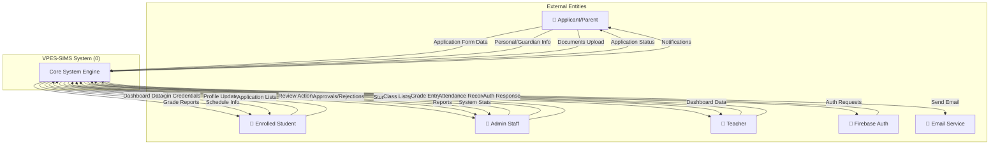
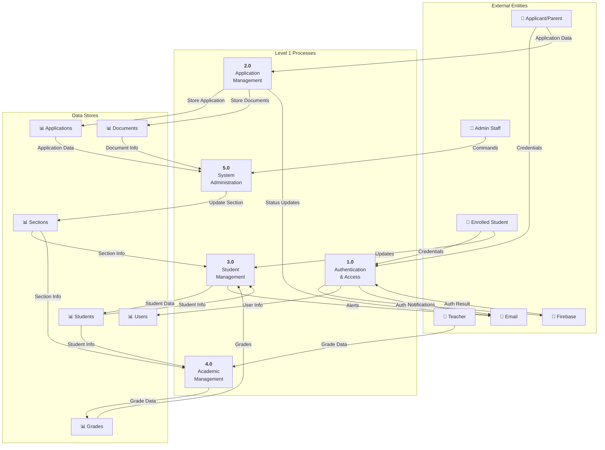
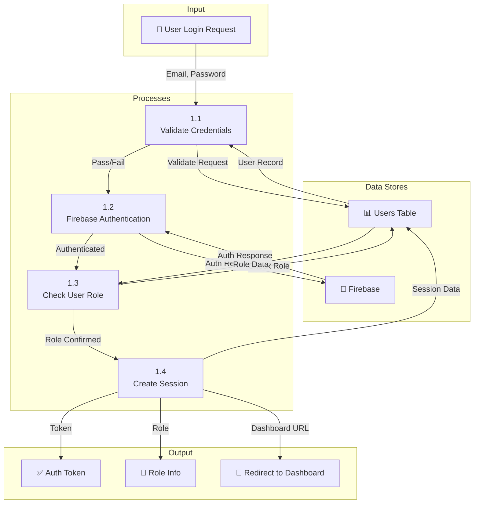
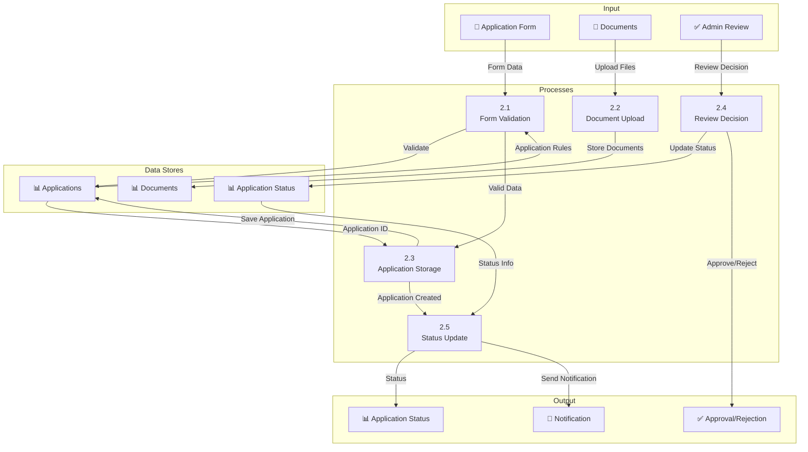
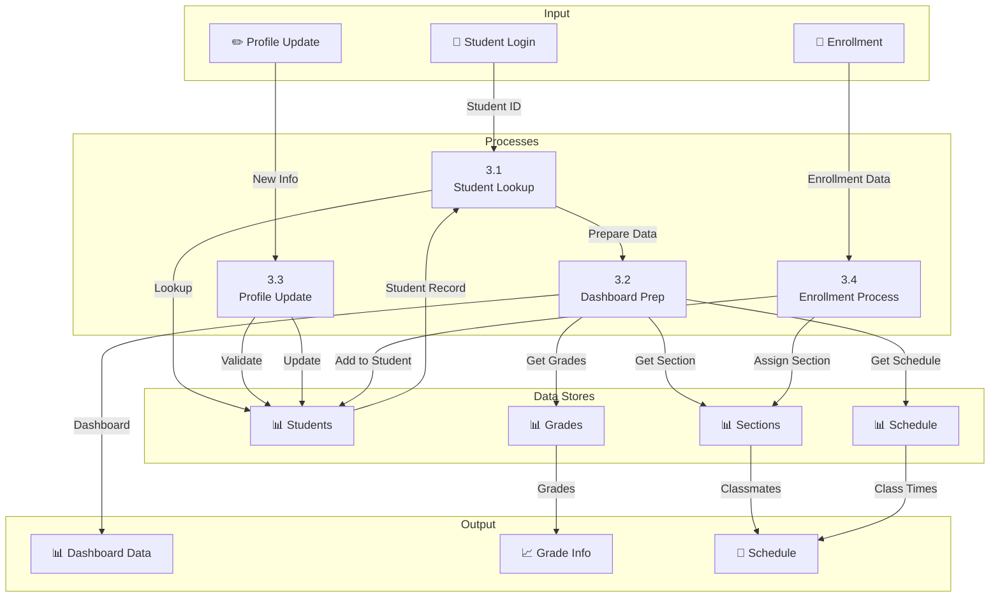
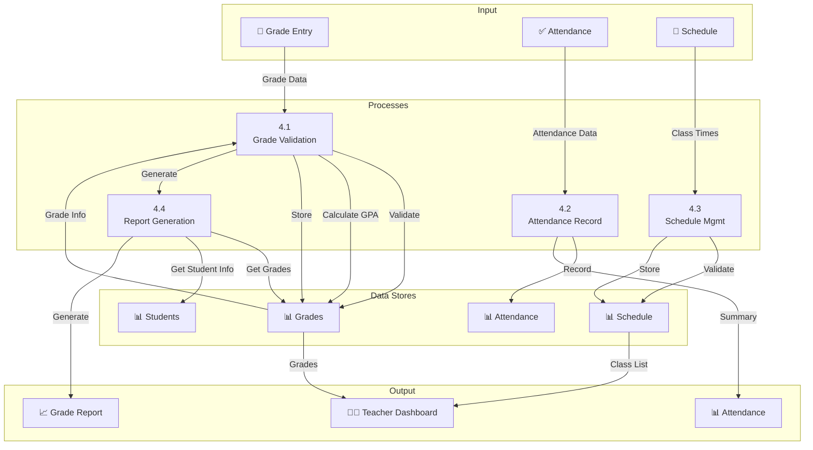
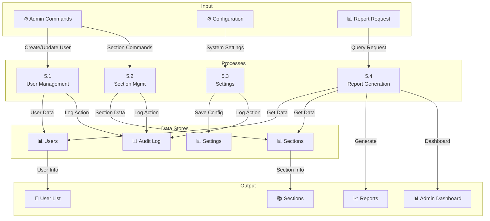

# VPES-SIMS - DATA FLOW DIAGRAM (VISUAL)
**Vinzons Pilot Elementary School - Student Information Management System**

---

## CONTEXT DIAGRAM (Level 0)

### Mermaid Format:


---

## LEVEL 1 DFD - Main Processes

### Mermaid Format:


---

## LEVEL 2 DFD - Detailed Processes

### 1.0 Authentication & Access Control



### 2.0 Application Management



### 3.0 Student Management



### 4.0 Academic Management



### 5.0 System Administration



---

## DATA STORES REFERENCE

| ID | Name | Purpose | Key Fields |
|---|---|---|---|
| D1 | Users | User accounts & credentials | user_id, email, password_hash, role |
| D2 | Applications | Enrollment applications | app_id, applicant_email, status, submitted_date |
| D3 | Students | Enrolled student records | student_id, LRN, full_name, grade_level |
| D4 | Grades | Academic grades | grade_id, student_id, subject, score |
| D5 | Documents | Uploaded documents | doc_id, application_id, document_type, file_path |
| D6 | Sections | Class sections | section_id, grade_level, teacher_id |
| D7 | Schedule | Class schedule | schedule_id, section_id, subject, time_slot |
| D8 | Attendance | Attendance records | attendance_id, student_id, date, present |
| D9 | Settings | System configuration | setting_key, setting_value |
| D10 | Audit Log | Admin action logs | log_id, admin_id, action, timestamp |

---

## DATA FLOWS SUMMARY

### From Applicant/Parent:
- **Application Form Data** → P2.0 (Application Management)
- **Documents** → P2.0 (Application Management)
- **Login Credentials** → P1.0 (Authentication)

### From Enrolled Student:
- **Login Credentials** → P1.0 (Authentication)
- **Profile Updates** → P3.0 (Student Management)

### From Admin:
- **Admin Commands** → P5.0 (System Administration)
- **Review Actions** → P2.0 (Application Management)
- **User Management** → P5.0 (System Administration)

### From Teacher:
- **Grade Entry** → P4.0 (Academic Management)
- **Attendance Records** → P4.0 (Academic Management)

### To External Systems:
- **Authentication Requests** → Firebase Auth Service
- **Email Notifications** → Email Service

---

## SYSTEM FLOWS DIAGRAM

```
APPLICANT → [Application Form] → SYSTEM → [Application Review] → ADMIN
                                    ↓
                            [Document Storage]
                                    ↓
                            [Send Notification] → EMAIL
                                    ↓
                          [Enrollment Decision]
                                    ↓
                              APPROVED ↓ REJECTED
                                    ↓
                            [Create Student] 
                                    ↓
                            [Assign Section]
                                    ↓
                          [Welcome Email] → EMAIL
                                    ↓
                            STUDENT ACCOUNT READY
                                    ↓
STUDENT → [Login] → [View Dashboard] → [Grades, Schedule, Info]
            ↓
      [Firebase Auth] → [Session]
            ↓
      [Access Student Module]
            ↓
      [View Grades, Schedule, Section]

TEACHER → [Login] → [View Classes] → [Enter Grades]
            ↓
      [View Student List]
            ↓
      [Mark Attendance]
            ↓
      [System Updates D4.0]

ADMIN → [Login] → [Admin Dashboard]
          ↓
      [Review Applications] → [Approve/Reject]
          ↓
      [Manage Users] → [Create/Edit/Delete]
          ↓
      [Manage Sections] → [Create Classes]
          ↓
      [View Reports] → [Statistics]
```

---

## TECHNICAL ARCHITECTURE REFERENCE

### Technology Stack:
- **Frontend:** HTML, CSS, JavaScript
- **Backend:** PHP
- **Database:** MySQL
- **Authentication:** Firebase Authentication
- **Server:** Apache (XAMPP)

### Key Tables in System:
```
users → Applications → Documents
        ↓
      Students → Grades
        ↓        ↓
      Sections ← Schedule
        ↓
    Attendance
```

---

**Generated:** December 12, 2025  
**Format:** Mermaid Diagrams + ASCII Flow Diagrams  
**Notation:** Gane-Sarson (adapted for web system)
